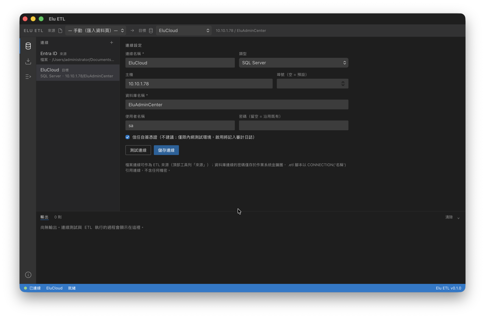
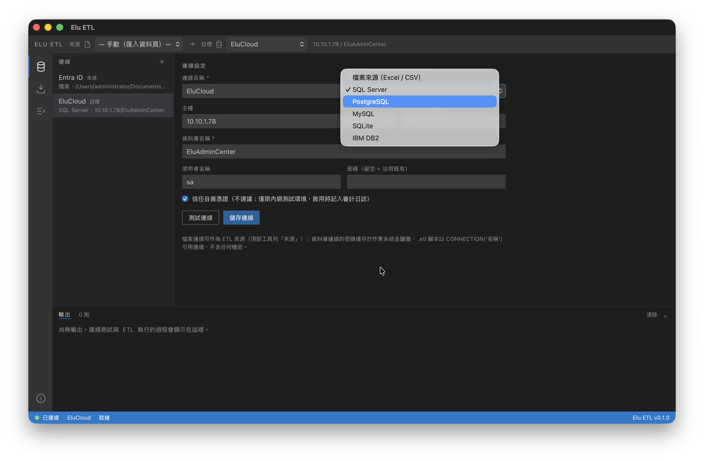
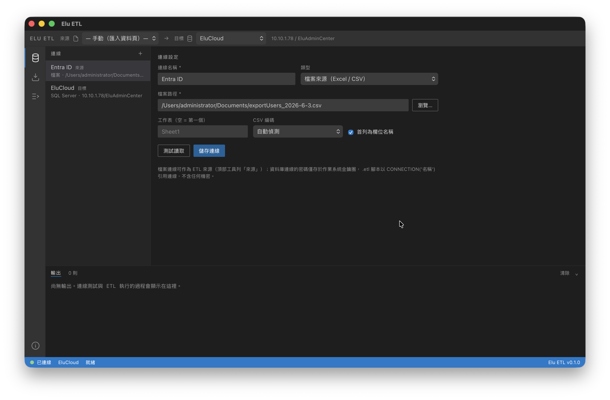
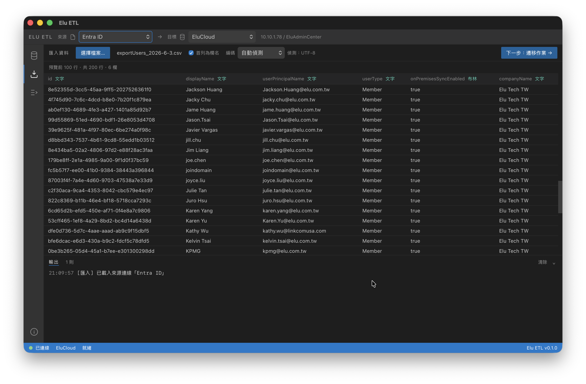
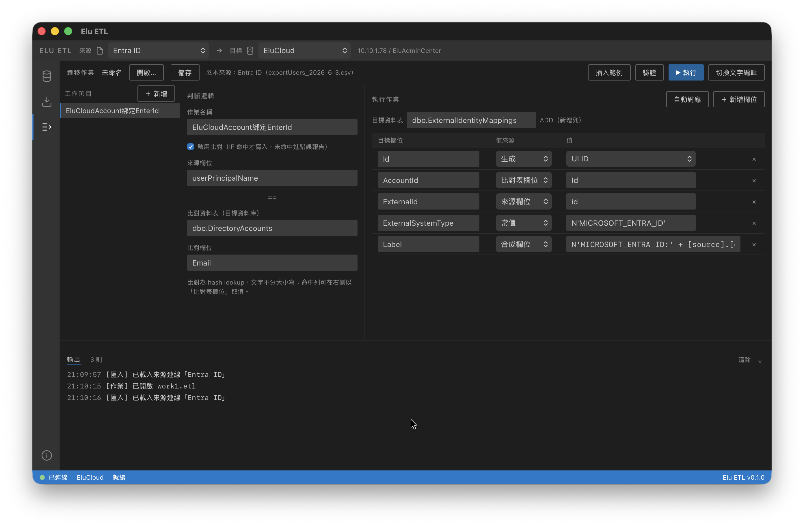
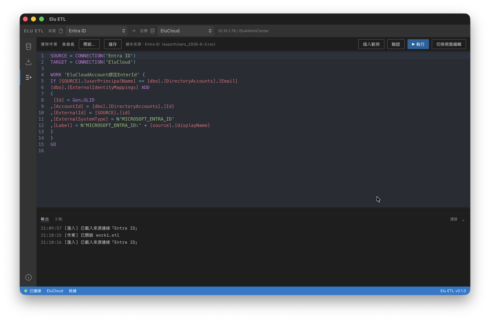
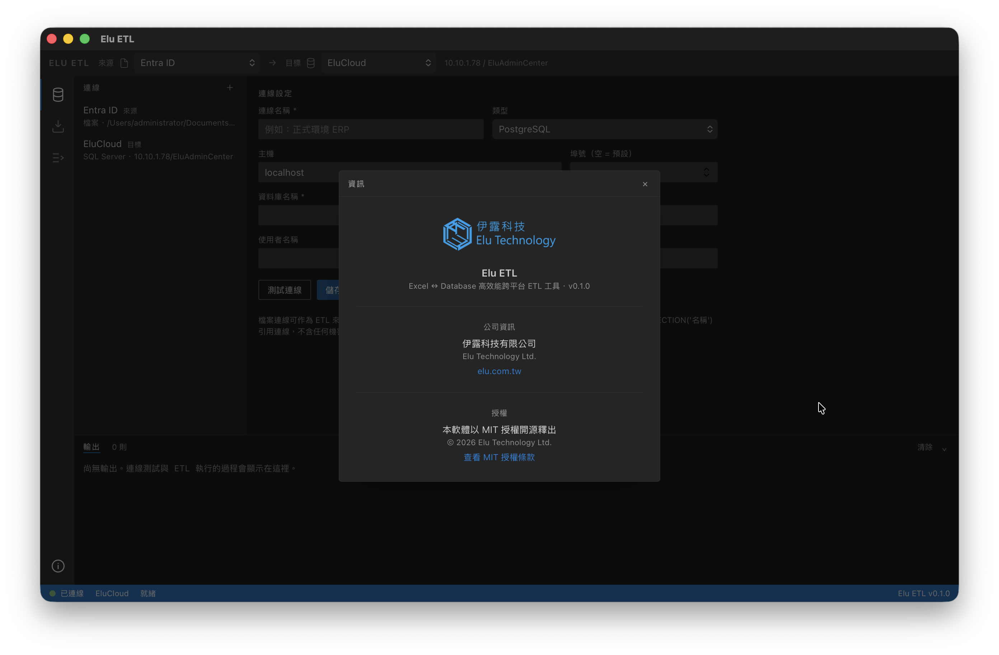

# Elu ETL

Excel ↔ Database 高效能跨平台 ETL 桌面工具，以 **Rust + Tauri 2 + Angular 20** 打造。
透過圖形介面完成 Excel / CSV 與 SQL 資料庫之間的資料遷移。SQL Server / PostgreSQL /
MySQL / SQLite 皆為純 Rust Managed Driver，無需安裝 ODBC 或任何外部驅動；
IBM DB2 為選用支援（`db2` feature），需另行安裝 IBM 驅動（見下文）。

> 開發計畫書與完整規格見 [docs/development-plan.md](docs/development-plan.md)。

## 特色

- **零驅動依賴** — SQL Server（tiberius）、PostgreSQL / MySQL / SQLite（sqlx）皆為純 Rust 驅動，TLS 走 rustls
- **IBM DB2（選用）** — 以 `ibm_db`（IBM CLI / ODBC 驅動）支援 DB2；非純 Rust，預設不編譯，需 `--features db2` 並安裝 IBM Data Server Driver。選擇 DB2 連線類型時自動偵測驅動，未就緒即提示安裝與下載連結
- **檔案來源** — Excel（calamine）與 CSV（chardetng 自動偵測編碼，支援 Big5），查詢結果可匯出 xlsx（rust_xlsxwriter，常數記憶體模式）
- **ETL 腳本 DSL** — 以 `WORK { … }` 描述遷移作業：lookup 比對、欄位指派、常值、`Gen.XXX` 產生器、`{…}` 字串模板合成欄位；`.etl` 檔自包含來源與目標宣告
- **企業級執行語意** — 批次交易 + checkpoint 續跑、可取消、錯誤政策（續跑 / 首錯即停 / 錯誤率上限）、錯誤明細報告
- **安全設計** — 密碼一律存 OS keychain（keyring），絕不寫入腳本或設定檔；identifier 白名單驗證防 SQL 注入；自簽憑證信任需明確勾選並記入審計日誌
- **VSCode 風格介面** — 深色專業 UI、活動列導覽、分頁式輸出面板（輸出 / 診斷 / 結果）、狀態列連線指示燈與即時 ETL 進度

## 技術棧

| 層 | 技術 |
|---|---|
| 桌面框架 | Tauri 2（dialog / fs / store / opener plugins） |
| 前端 | Angular 20（standalone components + signals）、Tailwind CSS 4、CodeMirror 6 |
| 後端核心 | Rust（tokio 非同步 + rayon 平行轉換） |
| 資料庫 | tiberius（SQL Server）、sqlx 0.9（PostgreSQL / MySQL / SQLite）、ibm_db（IBM DB2，選用 `db2` feature）、deadpool 連線池 |
| 檔案解析 | calamine（Excel）、csv + chardetng + encoding_rs（CSV） |
| 可觀測性 | tracing + tracing-appender（含 audit 日誌） |

## 介面與工作流程

頂部工具列提供全域的「**來源 → 目標**」選擇器（來源可為檔案或資料庫連線，目標為資料庫連線），三個頁面構成完整流程：

1. **資料庫連線**（`/connections`）— 管理五種資料庫連線（SQL Server / PostgreSQL / MySQL / SQLite / IBM DB2）與 FILE 檔案連線；測試連線、密碼存入 OS keychain。選擇 IBM DB2 時自動偵測驅動，未就緒則顯示安裝提示與下載連結。檔案連線僅能作為 ETL 來源，不能作為目標。
2. **匯入資料**（`/import`）— 預覽來源：選擇 Excel 工作表 / CSV 編碼 / 首列表頭，或瀏覽資料庫連線的資料表、執行自訂 SQL 預覽，並可將查詢結果匯出為 Excel。
3. **遷移作業**（`/works`）— 核心頁面：視覺化編輯器與 DSL 腳本編輯器（CodeMirror，含語法高亮與行號診斷）雙向同步；驗證、執行、開啟 / 儲存 `.etl` 檔。

（舊路由 `/mapping`、`/script`、`/execute` 已整合至 `/works`。）

## 螢幕截圖

### 連線管理（`/connections`）

<table>
<tr>
<td width="50%"></td>
<td width="50%"></td>
</tr>
<tr>
<td align="center"><sub>SQL Server 連線（可勾選信任自簽憑證）</sub></td>
<td align="center"><sub>支援五種資料庫：SQL Server / PostgreSQL / MySQL / SQLite / IBM DB2</sub></td>
</tr>
<tr>
<td width="50%"></td>
<td width="50%"></td>
</tr>
<tr>
<td align="center"><sub>FILE 檔案來源（Excel / CSV，CSV 編碼自動偵測，支援 Big5）</sub></td>
<td></td>
</tr>
</table>

### 來源預覽（`/import`）



> 瀏覽資料庫資料表或執行自訂 SQL 預覽，並可將結果匯出為 Excel。

### 遷移作業（`/works`）

視覺化編輯器與 DSL 腳本編輯器雙向同步：

<table>
<tr>
<td width="50%"></td>
<td width="50%"></td>
</tr>
<tr>
<td align="center"><sub>視覺化欄位對應（比對表 lookup、產生器、合成欄位）</sub></td>
<td align="center"><sub>DSL 腳本編輯器（CodeMirror，語法高亮 + 行號診斷）</sub></td>
</tr>
</table>

### 資訊視窗

<p align="center"></p>

> 公司資訊與 MIT 開源授權。

## ETL 腳本 DSL

```sql
-- .etl 檔可自包含來源與目標（標頭為選擇性，未宣告時使用工具列的工作區選擇）
SOURCE = FILE(TYPE=CSV, PATH='C:\data\users.csv', ENCODING='Big5', HEADER=TRUE)
TARGET = CONNECTION('正式環境 ERP')

WORK 'EluCloudAccount綁定EnterId' {
  If [SOURCE].[userPrincipalName] == [dbo].[DirectoryAccounts].[Email]
  [dbo].[ExternalIdentityMappings]
  ADD {
     [Id] = Gen.ULID
    ,[AccountId] = [dbo].[DirectoryAccounts].[Id]
    ,[ExternalId] = [SOURCE].[id]
    ,[ExternalSystemType] = N'MICROSOFT_ENTRA_ID'
    ,[Label] = N'MICROSOFT_ENTRA_ID: {[dbo].[DirectoryAccounts].[DisplayName]}'
  }
}
GO
```

語意：來源每一列以 `If` 條件對目標資料庫的比對表做 **hash lookup**（文字不分大小寫），
命中者組裝欄位後批次 INSERT 到目標表，未命中列進錯誤報告。

### 語法要點

- 關鍵字不分大小寫；`--` 或 `//` 為單行註解，`///` ~ `///` 為多行註解；識別字可用 `[名稱]` 或裸字
- 標頭（順序不拘、皆為選擇性）：
  - `SOURCE = FILE(PATH='…' [, TYPE=…, SHEET='…', ENCODING='…', HEADER=TRUE|FALSE])`
  - `SOURCE = CONNECTION('已儲存連線名稱' [, TABLE='…' | QUERY='…'])`
  - `TARGET = CONNECTION('已儲存連線名稱')` — 僅支援引用已儲存連線，密碼留在 keychain
- 工作項目以 `WORK '名稱' { … }` 包裹（舊式 `GO` 分隔仍相容）；`If` 條件可省略（全部插入）
- 指派值可為：來源 / 比對表欄位、`N'文字'`、數字、`TRUE` / `FALSE` / `NULL`、產生器，或**字串模板合成欄位**
- **字串模板**（合成欄位）：`N'前綴: {[SOURCE].[欄位]} 尾碼'` —— 固定文字直接寫，動態值（欄位 / 比對表欄位 / `Gen.XXX` / 數值）放在 `{…}` 內，各項轉文字後串接（`NULL` 視為空字串）；字面大括號以 `{{` / `}}` 跳脫。舊式 `'前綴' + [欄位]` 串接仍可解析，會正規化為模板形式

### `Gen.XXX` 產生器

| 產生器 | 說明 |
|---|---|
| `Gen.GUID` / `Gen.GUID(Text)` | UUID v4，每列產生新值 |
| `Gen.ULID` | 26 字元 Crockford base32，時間排序友善 |
| `Gen.Date` / `Gen.DateTime` / `Gen.DateTimeOffset`（含 `(Text)` 變體） | 執行當下日期 / 時間，同一次執行內所有列一致 |
| `Gen.SHA256` / `Gen.SHA512` / `Gen.MD5` | 來源整列雜湊（hex 小寫） |

## 執行語意

- **批次寫入** — 預設每批 5,000 列，多列 VALUES 依各 DB 參數上限自動分段
- **寫入模式** — 每批一交易 + checkpoint（預設，可續跑）或整個任務單一交易（任何錯誤全部回滾）
- **錯誤政策** — 錯誤列進報告繼續執行（預設）、首錯即停、或錯誤率超過上限自動中止
- **續跑** — 任務設定序列化存於 app data 的 state.db，`resume_etl` 自最後成功批次的下一批接續
- **取消** — 協作式取消：當前批次完成或回滾後停止
- **進度** — 經 Tauri Channel 即時推送（階段 / 批次 / 成功與錯誤列數），顯示於狀態列；錯誤明細最多保留 1,000 筆

## 專案結構

```
src/                       Angular 前端
├── app/pages/
│   ├── connections/       連線管理
│   ├── import/            來源預覽與匯入
│   └── works/             遷移作業（視覺化 + DSL 編輯器）
└── app/services/          Tauri IPC、工作區狀態、ETL 狀態、日誌

src-tauri/src/             Rust 後端
├── commands/              Tauri IPC commands（database / excel / etl）
├── db/                    驅動抽象層 + 五種 DB 驅動（DB2 經 db2 feature gate）+ 連線池 + SQL 方言引用
├── etl/                   執行器、欄位對應、型別轉換、來源讀取
│   └── script/            DSL：parser（手寫 lexer + recursive descent）、AST、
│                          executor（lookup join）、gen（產生器）
├── excel/                 Excel / CSV 讀寫、schema 推斷
├── models/                連線設定、值型別、錯誤
├── security/              OS keychain、SecretString
├── state/                 state.db（任務 / checkpoint 持久化）
└── telemetry/             tracing 初始化（含 audit）
```

## 開發

### 前置需求

- Node.js 20+、Rust stable toolchain
- Linux 另需 `libwebkit2gtk-4.1-dev` 等系統套件（清單見 [.github/workflows/ci.yml](.github/workflows/ci.yml)）

### 常用指令

```bash
npm install              # 安裝前端依賴
npm run tauri dev        # 開發模式（Angular dev server :1420 + Tauri 視窗）
npm run tauri build      # 產出安裝包
cargo test               # Rust 單元 + 整合測試（src-tauri/ 下執行；
                         # 含 SQLite end-to-end 腳本測試）
```

### IBM DB2（選用）

DB2 沒有成熟的純 Rust 驅動，連線倚賴 IBM 原生 CLI / ODBC 驅動（`ibm_db` crate），
故以 `db2` cargo feature 隔離、**預設不編譯**——核心建置與 CI 維持純 Rust、無外部驅動需求。
需要 DB2 時：

```bash
# 1. 安裝 IBM Data Server Driver（clidriver），並設定 IBM_DB_HOME 環境變數
#    下載：https://www.ibm.com/support/pages/db2-data-server-driver-package-ds-driver
# 2. 以 db2 feature 編譯 / 打包
cargo build --features db2
npm run tauri build -- --features db2
```

未以 `db2` feature 建置時，DB2 連線仍可在 `/connections` 建立，但實際連線會回報
「此版本未編譯 DB2 支援」；前端在選擇 IBM DB2 類型時即呼叫 `check_db2_driver` 偵測環境，
未就緒則顯示安裝提示與下載連結。DB2 路徑（`src-tauri/src/db/db2.rs` 的 feature-gate 區塊）
需於備有 clidriver 的環境驗證連線行為。

### CI / Release

- **CI**（[ci.yml](.github/workflows/ci.yml)）— push / PR 於 Ubuntu、macOS、Windows 三平台建置與測試
- **Release**（[release.yml](.github/workflows/release.yml)）— 打 `v*` tag 觸發，產出三平台安裝包並建立 GitHub Release 草稿：
  - Windows：NSIS `.exe` + `.msi`
  - macOS：universal `.dmg`（Apple Silicon + Intel）
  - Linux：`.AppImage` + `.deb`
  - 程式碼簽署與 notarization 為 Phase 3 待辦

---

© Elu Technology Ltd.
